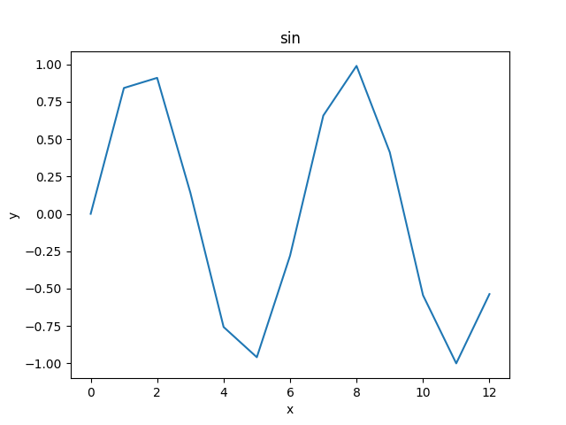

---
title: Title of report
author: Tanuki Kitune
date: 2017.1.1
...

# First section

This is an example report content.

## How to include images

Including png image:

{ width=10cm }

Including pdf image:

{ width=10cm }

You can use tex reference like Figure \ref{fig:png_sample} and \ref{fig:pdf_sample}

## Citation

You can cite an article like: [@Krizhevsky2012]

## First sub-section

You can put list of items using itemize:

* Monday
* Tuesday
* Wednesday
* Thursday
* Friday
* Saturday
* Sunday

Or, numbering:

1. Totato
2. Carrot
3. Onion

## Other expressions

* Italic*
* _Italic2_
* **bold**
* __bold2__


## Quatation

> Quotation

## URL

URL: [www.waseda.jp](https://www.waseda.jp)

## Table

Table:

|  A  |  B  |  C  |
| --- | --- | --- |
|  22  |  99  |  128  |

## Math expressions

Formula:

$$
\frac{\partial^2 p}{\partial t^2} = c^2 \nabla^2 p
$$


\begin{eqnarray}
  2x_1 + x_2 & = & 5 \\
    2x_2 & = & 2
\end{eqnarray}


## Source code

Source code:


```test.py
t = np.arange(0, np.pi*4)
plt.plot(t, np.sin(t))
```

# References
